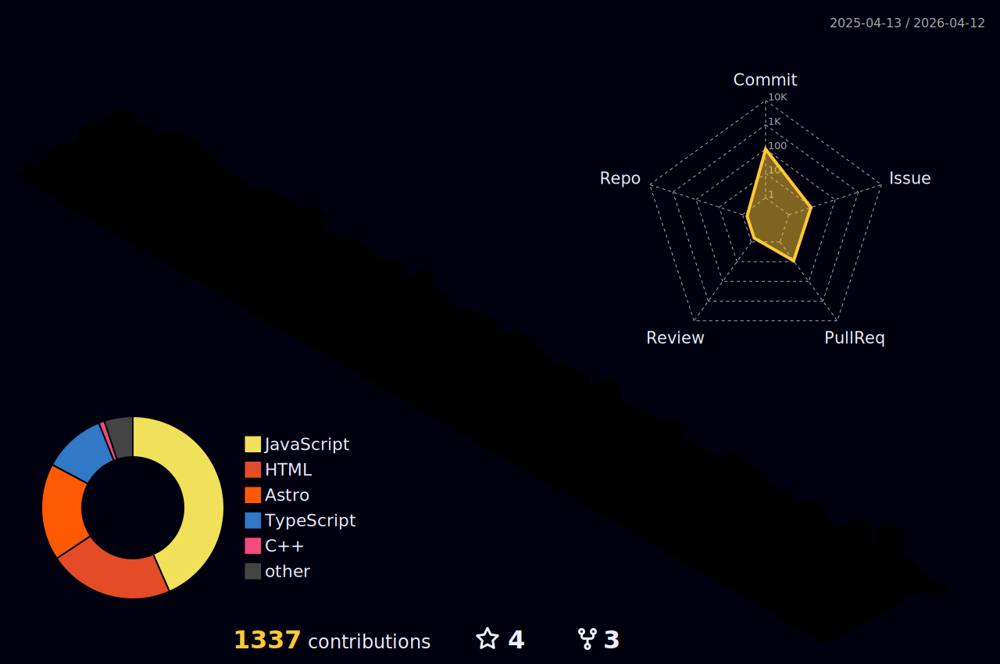

## 📩 Latest Blog Posts
<!-- BLOG-POST-LIST:START -->
- [Nginx란, 웹서버 개념이해](https://softourr.vercel.app/posts/feq/nginx%EB%9E%80-%EC%9B%B9%EC%84%9C%EB%B2%84-%EA%B0%9C%EB%85%90%EC%9D%B4%ED%95%B4/)
- [트리쉐이킹과 번들링   1](https://softourr.vercel.app/posts/feq/%ED%8A%B8%EB%A6%AC%EC%89%90%EC%9D%B4%ED%82%B9%EA%B3%BC-%EB%B2%88%EB%93%A4%EB%A7%81---1/)
- [React&rpar; 리액트에서 SOLID의 OCP&lpar;Open Closed&rpar; 적용에 대하여](https://softourr.vercel.app/posts/react/react-%EB%A6%AC%EC%95%A1%ED%8A%B8%EC%97%90%EC%84%9C-solid%EC%9D%98-ocpopen-closed-%EC%A0%81%EC%9A%A9%EC%97%90-%EB%8C%80%ED%95%98%EC%97%AC/)
- [useEffect를 이용하여 로딩 상태 관리하는 방법과 Suspense를 활용하는 방법에 대한 차이점을 설명해주세요.](https://softourr.vercel.app/posts/feq/useeffect%EB%A5%BC-%EC%9D%B4%EC%9A%A9%ED%95%98%EC%97%AC-%EB%A1%9C%EB%94%A9-%EC%83%81%ED%83%9C-%EA%B4%80%EB%A6%AC%ED%95%98%EB%8A%94-%EB%B0%A9%EB%B2%95%EA%B3%BC-suspense%EB%A5%BC-%ED%99%9C%EC%9A%A9%ED%95%98%EB%8A%94-%EB%B0%A9%EB%B2%95%EC%97%90-%EB%8C%80%ED%95%9C-%EC%B0%A8%EC%9D%B4%EC%A0%90%EC%9D%84-%EC%84%A4%EB%AA%85%ED%95%B4%EC%A3%BC%EC%84%B8%EC%9A%94/)
- [테스트하기 좋은 코드, 코드 리뷰의 기준 잡기](https://softourr.vercel.app/posts/feq/%ED%85%8C%EC%8A%A4%ED%8A%B8%ED%95%98%EA%B8%B0-%EC%A2%8B%EC%9D%80-%EC%BD%94%EB%93%9C-%EC%BD%94%EB%93%9C-%EB%A6%AC%EB%B7%B0%EC%9D%98-%EA%B8%B0%EC%A4%80-%EC%9E%A1%EA%B8%B0/)
<!-- BLOG-POST-LIST:END -->

## 🌿 Latest TIL

<!-- TIL-POST-LIST:START -->
- React 프론트엔드 CI/CD 구축 과정
- 📹 영상 데이터 2단계 백업 시스템 구축하기
- React 애니메이션 클로저 이슈 트러블슈팅
- 📄 Docker 컨테이너 메모리 부족 문제 트러블슈팅
<!-- TIL-POST-LIST:END -->

---
🌱 I'm interested in `Front-end` development!  
📫 Major in `KMU Software Engineering Department`  
✨ Currently studying 

---

<!------------------>

  

    
  

  
Contribution

  

