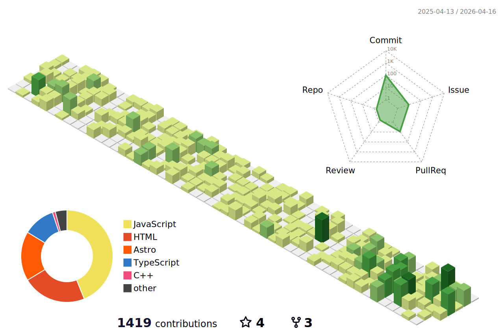

<!-- https://github.com/DenverCoder1/readme-typing-svg  -->

  

🌱 I'm interested in `Front-end` development!  
📫 Major in Computer Science  
✨ Currently studying 

  
🧩 [`blog`](https://hhzzzk.github.io/)

   
  

