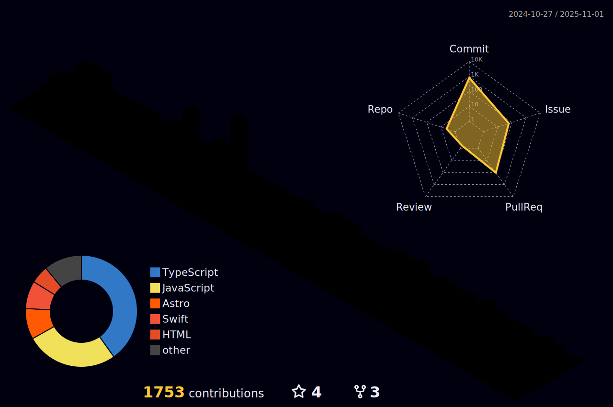

## 📩 Latest Blog Posts
<!-- BLOG-POST-LIST:START -->
- [Next.js의 SSR와 React 19의 RSC 정리](https://softourr.vercel.app/posts/next/nextjs%EC%9D%98-ssr%EC%99%80-react-19%EC%9D%98-rsc-%EC%A0%95%EB%A6%AC/)
- [React의 Error Boundary는 왜 비동기 에러를 잡지 못하나요](https://softourr.vercel.app/posts/react/react%EC%9D%98-error-boundary%EB%8A%94-%EC%99%9C-%EB%B9%84%EB%8F%99%EA%B8%B0-%EC%97%90%EB%9F%AC%EB%A5%BC-%EC%9E%A1%EC%A7%80-%EB%AA%BB%ED%95%98%EB%82%98%EC%9A%94/)
- [서버리스 시작할까하니 바로 뜨는 공포 이야기](https://softourr.vercel.app/posts/blogging/%EC%84%9C%EB%B2%84%EB%A6%AC%EC%8A%A4-%EC%8B%9C%EC%9E%91%ED%95%A0%EA%B9%8C%ED%95%98%EB%8B%88-%EB%B0%94%EB%A1%9C-%EB%9C%A8%EB%8A%94-%EA%B3%B5%ED%8F%AC-%EC%9D%B4%EC%95%BC%EA%B8%B0/)
- [Nginx란, 웹서버 개념이해](https://softourr.vercel.app/posts/feq/nginx%EB%9E%80-%EC%9B%B9%EC%84%9C%EB%B2%84-%EA%B0%9C%EB%85%90%EC%9D%B4%ED%95%B4/)
- [트리쉐이킹과 번들링   1](https://softourr.vercel.app/posts/feq/%ED%8A%B8%EB%A6%AC%EC%89%90%EC%9D%B4%ED%82%B9%EA%B3%BC-%EB%B2%88%EB%93%A4%EB%A7%81---1/)
<!-- BLOG-POST-LIST:END -->

## 🌿 Latest TIL

<!-- TIL-POST-LIST:START -->
- 🍋 Notion 링크 도메인 연결 삽질기 (가비아 → Cloudflare → Fruition)
- 🌐 DNS 레코드, 이메일 인증과 관련된 핵심 정리
- 📦 Docker 볼륨(Volume)이란?
- Terraform 프로젝트 구성 및 배포 시퀀스
- React 프론트엔드 CI/CD 구축 과정
<!-- TIL-POST-LIST:END -->

---
🌱 I'm interested in `Front-end` development!  
📫 Major in `KMU Software Engineering Department`  
✨ Currently studying 

---

<!------------------>

  

    
  

  
Contribution

  

